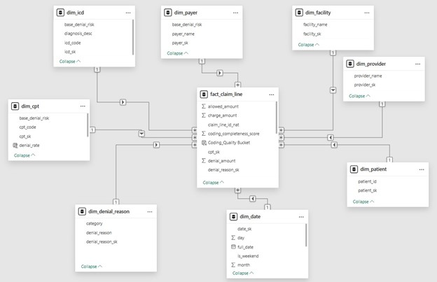
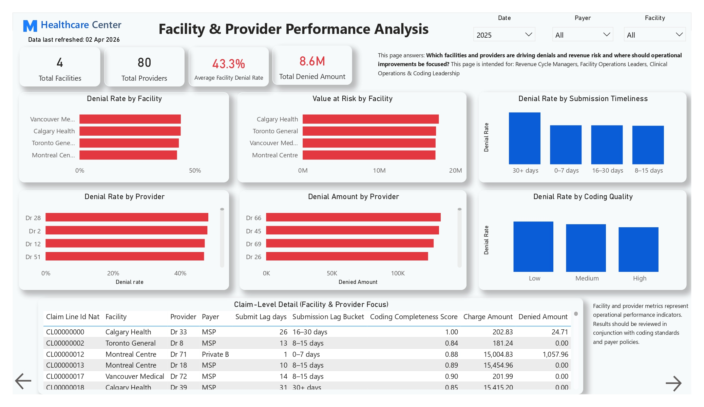
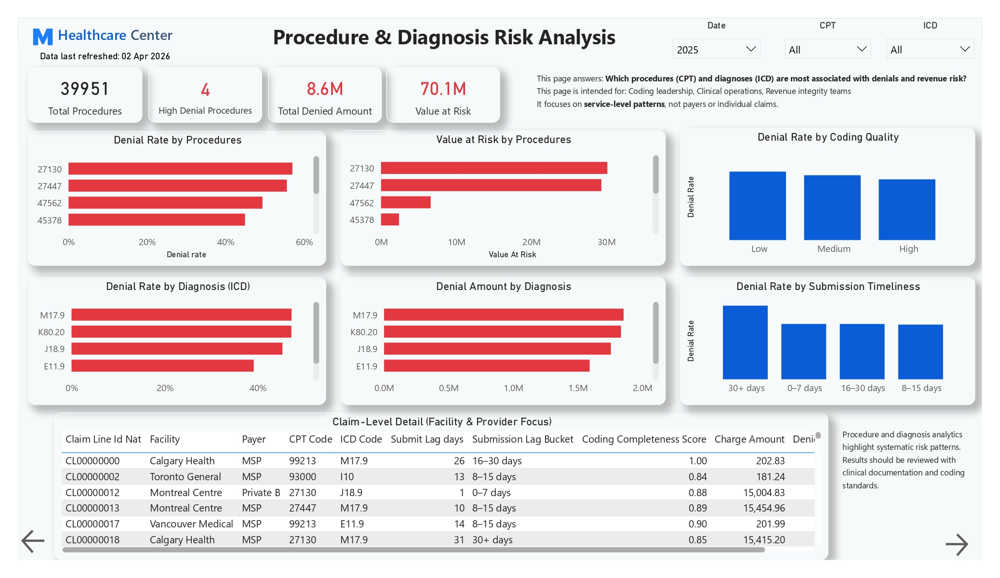

# MapleCare-Health-Claim-Denial-Root-Cause-Analysis-Claim-Denial-Risk-Prediction
Built an end-to-end healthcare analytics solution to analyze claim denials and predict high-risk claims using ML. Enabled proactive risk prioritization, improved revenue visibility, and delivered realistic, governance-driven insights through Power BI dashboards.


**Role:** Lead Healthcare Data Analyst, Consultant & AI Architect  
**Domain:** Healthcare Revenue Cycle Analytics  
**Objective:** Identify denial drivers and predict high-risk claims pre-submission using Machine Learning  

---

## 🔗 View Live Demo

👉 **[View Power BI Dashboard](https://app.powerbi.com/)**  

---

## 🧩 Tech Stack

- **Cloud:** Azure  
- **Data Engineering:** Azure Data Factory  
- **Database:** Azure SQL Server  
- **Machine Learning:** Python, Scikit-Learn  
- **Visualization:** Power BI  

---

## 🎯 Background – Who the Project Was for and Why It Mattered

Healthcare providers face persistent revenue loss due to **insurance claim denials, delayed reimbursements, and operational inefficiencies**. Even small denial percentages can translate into significant financial impact at scale, while also increasing administrative workload across billing, coding, and revenue cycle teams.

This project was developed for a **mid to large healthcare organization** seeking to improve visibility into its revenue cycle performance. The primary audience included **executive leadership, revenue cycle managers**, and **operational teams** responsible for claim submission, coding, and payer management.

Existing reporting focused largely on **static financial summaries**, offering limited insight into why denials occurred or where proactive intervention could reduce risk. There was also growing interest in using **machine learning** to support decision making, but without clear governance around how predictive insights should be interpreted or applied.

The project therefore aimed to bridge the gap between **financial reporting, operational diagnostics, and responsible predictive analytics**, delivering insights that could support both strategic oversight and day to day operational action.


---

## 🛑 Problem Statement - The Specific Challenge or Gap
Despite having detailed billing and claims data, the organization lacked **clear, actionable insight into denial drivers and revenue risk**. Existing reports showed what was denied and how much was lost, but not why those denials were occurring or where interventions would be most effective.

Key gaps included:
- Denials analyzed only at a **high financial level**, with limited operational context.
- No consistent way to connect **payer behavior, facility practices, provider patterns, and coding quality**.
- Delays in identifying problematic trends, resulting in **reactive appeals instead of proactive prevention**.
- Interest in machine learning existed, but there was **no framework to use ML responsibly**, increasing the risk of data leakage, over automation, or misleading results.

As a result, revenue cycle teams were spending significant effort **after denials occurred**, rather than focusing on **early risk identification and prioritization**, leading to unnecessary revenue leakage and operational strain.

Healthcare providers face significant revenue leakage due to insurance claim denials caused by:

---
## Objectives – What Success Looked Like
The objective of the project was to move from **reactive denial reporting** to **proactive, insight driven revenue cycle management**. Success was defined not by building dashboards or models in isolation, but by delivering **actionable clarity across strategic, operational, and analytical levels**.

Specifically, the project aimed to:
-	Provide **clear visibility into denial and revenue risk drivers** across payers, facilities, providers, procedures, and diagnoses.
-	Establish a** governed data model** that supports both analytics and machine learning use cases without leakage or misuse.
-	Enable **early identification of high risk claims** using pre submission information, supporting prioritization rather than automation.
-	Support different stakeholder needs through** role specific dashboards**, from executive oversight to operational drill downs.
-	Ensure all outputs are **interpretable, defensible, and realistically usable** in a healthcare revenue cycle context.

Success was achieved if leadership could understand where risk concentrates, operations teams could see what to act on first, and analytical outputs could be trusted to reflect **real world decision support**, not inflated or theoretical performance.

---

## ✔ Solution/Approach – What Was Done and Why
The approach was designed to address the business problem **end to end**, ensuring that analytical depth, data governance, and usability were treated as equally important. Rather than starting with dashboards or models, the solution was structured around **decision needs** and built backward from those requirements.

First, a **clean, transaction level data architecture** was established using a star schema model. Claim lines were identified as the correct analytical grain, with procedures (CPT) and diagnoses (ICD) modeled explicitly as dimensions. This structure ensured that financial, operational, and clinical perspectives could be analyzed together without duplicating logic or inflating results.
Next, **exploratory data analysis** was used to validate data quality, financial realism, and operational patterns. Sanity checks on amounts, submission delays, and distributions were performed to confirm that the data behaved in ways consistent with real healthcare revenue cycle workflows. Issues such as outliers and timing effects were intentionally retained where they represented genuine business scenarios.

Feature engineering was then performed to convert raw transactional data into **interpretable analytical signals**. This included operational timing buckets, coding quality groupings, and historical aggregation features that reflect how revenue cycle risk actually manifests in practice. Features were designed to be reusable across both dashboards and machine learning models.
For predictive analytics, machine learning was introduced with **strict guardrails**. Models were trained only on pre submission information, and early experiments revealed leakage that produced unrealistic performance. This prompted a deliberate redesign of the feature set, resulting in corrected, realistic models used solely for **risk prioritization**, not automated decision making.
Finally, all analytical and ML outputs were translated into** role specific Power BI dashboards** using a consistent six layer design framework. Each page was built with a clear intent—executive oversight, diagnostic analysis, operational prioritization, or action planning—ensuring that insights were delivered in a form aligned with how different stakeholders make decisions.

---

## Implementation – How It Was Executed
The solution was implemented using a **modular, step wise workflow**, ensuring that each stage was validated before progressing to the next. This reduced rework and helped surface data and modeling issues early.

### Tools and Technologies
-	**Python (pandas, NumPy, scikit learn)** for data preparation, feature engineering, and machine learning.
-	**Parquet and Excel** as intermediate storage formats to separate transactional data from analytics ready feature sets.
-	**Power BI** for data modeling, visualization, and dashboard delivery.
-	**DAX** for calculated measures, KPIs, and controlled aggregations.

## Process
### 1. Data Preparation & Modeling
Transactional claim line data was cleaned, standardized, and modeled using a star schema structure. CPT and ICD dimensions were added to support procedure  and diagnosis level analysis.

### 2. EDA & Validation
Data quality checks, financial sanity checks, temporal analysis, and outlier reviews were conducted to confirm realism and analytical suitability.

### 3. Feature Engineering
Operational and financial signals were derived, including submission delay buckets, coding quality groupings, historical aggregates, and interaction features. Outputs were stored in a separate analytics feature table.

### 4. Machine Learning
Models were trained iteratively. Initial results revealed leakage, which was corrected by restricting features to pre submission information. Final models were validated for realism and positioned strictly as prioritization tools.

### 5. Dashboard Development
Six Power BI pages were built using a consistent six layer layout, each aligned to a specific decision making role (executive, operational, diagnostic, or planning).

**Execution Style** The work followed an **iterative refinement approach** rather than a linear build. Feedback from modeling and dashboard design informed earlier steps, leading to adjustments in feature definitions, data modeling, and documentation.

---

## Results – Measurable Outcomes and Impact
The completed solution delivered** clear, realistic, and actionable results** across financial reporting, operational diagnostics, and risk prioritization.
From an analytics perspective, the dashboards provided **end to end visibility** into denial behavior and revenue exposure. Leadership gained a consolidated view of total charges, denial rates, denied amounts, and value at risk, while operational teams could drill into payer, facility, provider, procedure, and diagnosis level drivers. This replaced fragmented reporting with a **single, consistent source of truth**.
From a machine learning standpoint, the final, corrected models achieved **moderate but realistic predictive performance**. After removing post outcome leakage, the Gradient Boosting model delivered an ROC AUC of approximately** 0.65**, demonstrating meaningful signal without overstating precision. This validated that denial risk can be **partially anticipated using pre submission data**, but not eliminated or automated.

In practical terms, the model’s output was translated into **risk tiers** rather than binary decisions. This enabled operations teams to:
-	Identify a **subset of high risk claims** before submission
-	Prioritize reviews where potential denial impact was highest
-	Focus preventive effort rather than reactive appeals


The combination of analytics and ML resulted in:
-	Faster identification of denial prone patterns
-	Better targeting operational resources
-	Improved alignment between finance, operations, and coding teams

While the project did not aim to quantify dollar savings directly, it established the foundation for **measurable downstream impact**, such as reduced denial volume, improved cash flow timing, and lower rework costs.

---

### Data Modeling

- Designed a **Star Schema**

### Data Model



**Fact Table**
- `fact_claim_line`

**Dimension Tables**
- `dim_date`  
- `dim_patient`  
- `dim_provider`  
- `dim_payer`  
- `dim_facility`  
- `dim_denial_reason`
- `dim_cpt`
- `dim_icd`

---

### Machine Learning

- Model: **Gradient Boosting Machine**  
- Output: `Denial_Risk_Score (0–1)`  

**Key Insight:**  
- Initial model showed *perfect accuracy (leakage issue)*  
- Corrected model achieved **~0.65 ROC-AUC**, ensuring realistic performance  

---

### Visualization

- Built a **6-page Power BI dashboard**:

  - Executive Overview  
  - Payer Analysis  
  - Operational Risk (ML-Assisted)  
  - Facility & Provider Analysis  
  - Procedure & Diagnosis Analysis  
  - Executive Action Plan
 
  ## 📸 Dashboard Screenshots

### Executive Overview


### Payer Analysis 


### Operational Risk (ML-Assisted)


### Facility & Provider Analysis


### Procedure & Diagnosis Analysis 


### Executive Action Plan 


---

## End-to-End Architecture

```
Data Sources (EHR / Billing Systems)
        ↓
Azure Data Factory (ETL Pipelines)
        ↓
Azure SQL (Staging + Data Warehouse)
        ↓
Feature Engineering (Python)
        ↓
ML Model (Denial Risk Prediction)
        ↓
Power BI Dashboards
```

---

## 📊 Dashboard Insights

### Executive Overview
- Tracks total charges, denial rates, and value at risk  

### Payer Analysis
- Identifies high-denial payers and contract inefficiencies  

### Operational Risk Prioritization
- Highlights high-risk claims using ML scores  

### Facility & Provider Analysis
- Detects performance variations across entities  

### Procedure & Diagnosis Analysis
- Identifies high-risk CPT and ICD combinations  

---

## Results & ROI

- Enabled **proactive denial prevention strategy**  
- Identified high-risk claims before submission  
- Improved resource prioritization  
- Delivered realistic ML-based decision support  
- Created a unified analytics + ML framework  

---

## 💡 Key Learnings

- **Data leakage can invalidate ML models**  
- Moderate accuracy is *valuable and realistic*  
- Strong **data modeling is critical** for analytics success  
- ML should be used for **decision support, not automation**  

---

## 📁 Project Structure

```text
project-root/
│
├── data/                # Raw and processed datasets
├── notebooks/           # EDA & modeling
├── pipelines/           # ETL pipelines (ADF)
├── dashboards/          # Power BI files
├── images/              # Dashboard screenshots
└── README.md            # Documentation
```
---

## 👤 Consultant

**Atif Noorul Hasan** <br />
Healthcare Analytics Consultant <br />
Business Intelligence | Data Analytics | Dashboard Design <br />

🔗 Website – https://atifdata.com <br />
✉️ Email – atif@atifdata.com

